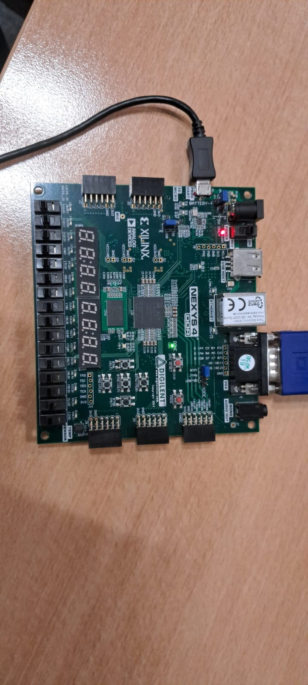
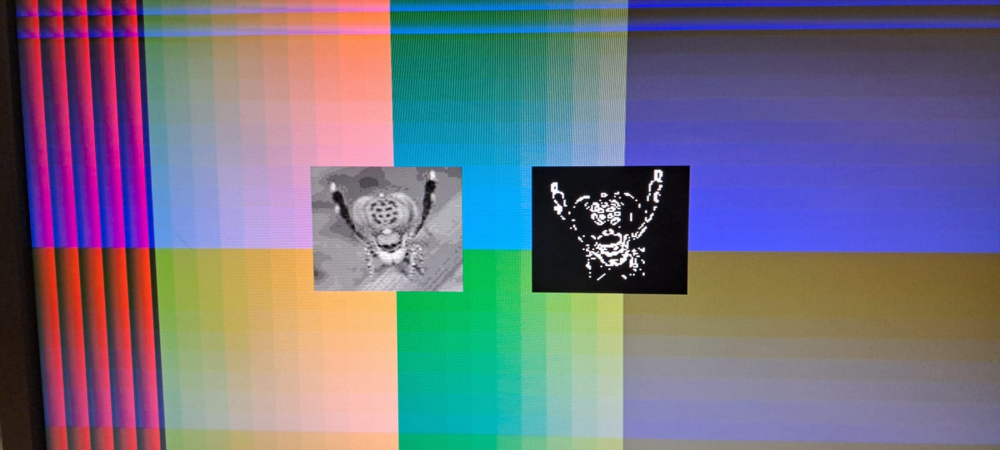

# Sobel Filter (VHDL)

This project implements a **Sobel edge-detection filter** in **VHDL**, targeting the **Xilinx Artix‑7 XC7A100T‑CSG324** FPGA. The design focuses on hardware implementation and verification through simulation and synthesis.



---

## Team Members
- **Killian Kerlau**  
- **Rémi Leluan**

---

## Tools & Software

- **Vivado (Xilinx)**  
  Used for synthesis, implementation, and bitstream generation for the Artix‑7 FPGA.

- **GHDL** (open‑source VHDL simulator)  
  Used to compile and simulate the design.

- **Surfer** (waveform viewer)  
  Used to visualize and analyze simulation signals.

---

## Simulation & Testbench

The design can be fully validated using the provided testbenches before FPGA deployment.

### Compilation

```bash
ghdl -a --std=08 --workdir=build sources/regUnit.vhd
ghdl -a --std=08 --workdir=build sources/tb_regUnit.vhd
```

### Simulation and Waveform Generation

```bash
ghdl -r --std=08 --workdir=build tb_regUnit \
  --vcd=build/wave.vcd \
  --assert-level=error \
  --stop-time=1us
```

The generated `wave.vcd` file can be opened with **Surfer** or Vivado to inspect internal signals and verify correct behavior.

---

## Results



The output clearly highlights the **edges of the bug**, demonstrating that the Sobel filter correctly detects image borders.

---

## Project Repository

The full source code and project files are available on GitHub:

👉 https://github.com/Kihax/sobel

